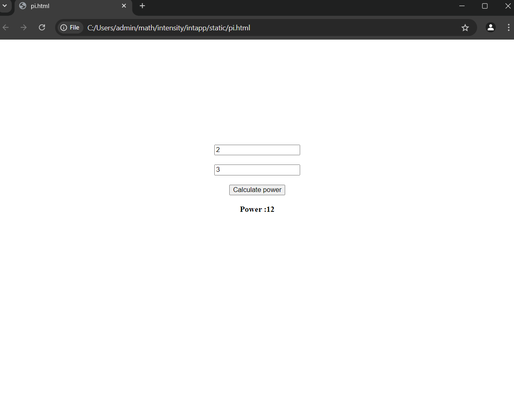

# Ex.05 Design a Website for Server Side Processing
## Date:07-12-2024

## AIM:
 To design a website to calculate the power of a lamp filament in an incandescent bulb in the server side. 


## FORMULA:
P = I<sup>2</sup>R
<br> P --> Power (in watts)
<br> I --> Intensity
<br> R --> Resistance

## DESIGN STEPS:

### Step 1:
Clone the repository from GitHub.

### Step 2:
Create Django Admin project.

### Step 3:
Create a New App under the Django Admin project.

### Step 4:
Create python programs for views and urls to perform server side processing.

### Step 5:
Create a HTML file to implement form based input and output.

### Step 6:
Publish the website in the given URL.

## PROGRAM :
```
<!DOCTYPE html>
<html>
    <head>
        <style>
            body{
                margin-top: 20%;
                font-weight: bold;
            }
        </style>
        <script>
            function power()
            {
                const i=document.getElementById("in").value;
                const r=document.getElementById("resistance").value;
                const p= i*i*r; 
                document.getElementById("answer").innerText="Power :"+ p;
            }
        </script>
    </head>
        <body>
            <center>
                <input type="number" placeholder="Enter Intensity" id="in"><br><br>
                <input type="number" placeholder="Enter Resistance" id="resistance"><br><br>
                <input type="button" onclick="power()" value="Calculate power"><br><br>
                <label id="answer"></label>
            </center>
        </body>
</html>
```

## SERVER SIDE PROCESSING:
```
    <script>
        function power()
        {
            const i=document.getElementById("in").value;
            const r=document.getElementById("resistance").value;
            const p= i*i*r; 
            document.getElementById("answer").innerText="Power :"+ p;
        }
    </script>
```

## HOMEPAGE:



## RESULT:
The program for performing server side processing is completed successfully.
